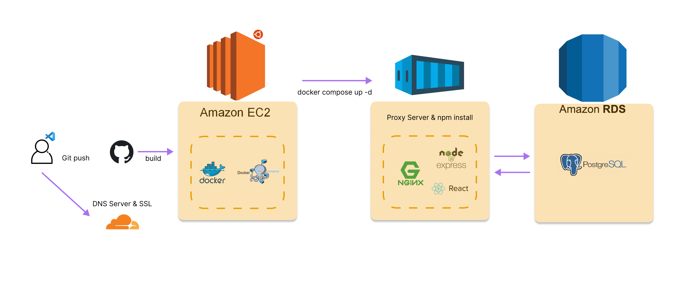

# 추억지도(2022.10.24 ~ 2022.11.07)

한 해를 기억하면 추억을 지도에 기록해보세요. 다양한 추억을 기록해 보고 링크를 공유해 자랑해 보세요
  
## [추억지도 접속하기](https://mp.donggeun.co.kr/map)

  
# Git Repo
## [Frontend GIT](https://github.com/tjrehdrms123/mp-client)
## [Backend GIT](https://github.com/tjrehdrms123/mp-server)
  

# 📖 목차 
 - [소개](#소개) 
 - [개발 환경](#개발-환경)
 - [사용 기술](#사용-기술)
 - [아키텍처](#시스템-아키텍처) 
 - [E-R 다이어그램](#e-r-다이어그램)
 - [Api 명세서](#-api-명세서)
 - [릴리즈 노트](#-MP-릴리즈-노트)
 - [화면 구성](#화면-구성)

  
## 📃소개
**추억지도**는 한 해를 기억하며 다양한 추억을 기록해 친구들과 공유하며 자랑 할 수 있습니다
 
참여율을 높이기위해 유저별 지도가 있으며 모든 추억을 볼수있는 지도도 있습니다.

## 개발 환경

 - Window 
 - Visual Studio Code
 - GitHub
 - DBeaver

## 사용 기술 

**웹서버**
 - Nginx

**백엔드**
 - NVM 
 - Node 16.18.0
 - Express
 - ParseServer & ParseDashboard

**프론트엔드**
 -  React
 -  Bootstrap
 
**빌드 툴**
 - Webpack

**데이터베이스**
 - PostgreSQL

**인프라** 
 - AWS EC2
 - Docker
 - Docker Compose

## 시스템 아키텍처

## 🛠 MP 릴리즈 노트

 2022-10-31 MP v1.1.0 릴리즈 보기

   
  <ul>
    <li>이메일 인증 제거</li>
    <li>폰트 변경</li>
    <li>글쓰기 유효성 검사 강화</li>
  </ul>

 2022-11-05 MP v1.2.0 릴리즈 보기

       
  <ul>
    <li>요청 Body 사이즈 기존 5M > 10M로 변경</li>
    <li>회원가입 여부에 따라 활성화 버튼 변경</li>
    <li>애드핏 광고 1개 > 4개로 변경</li>
  </ul>

  

## 💻화면 구성
||
| :-----------------------------------------------------------------------------------------------------------------: | :-----------------------------------------------------------------------------------------------------------------: | 
|로그인|회원가입

||
| :-----------------------------------------------------------------------------------------------------------------: | :-----------------------------------------------------------------------------------------------------------------: | 
|전체 추억|내 추억

||
| :-----------------------------------------------------------------------------------------------------------------: | :-----------------------------------------------------------------------------------------------------------------: | 
|비회원|지도 상세

||
| :-----------------------------------------------------------------------------------------------------------------: | :-----------------------------------------------------------------------------------------------------------------: | 
|추억 남기기|지도 검색하기